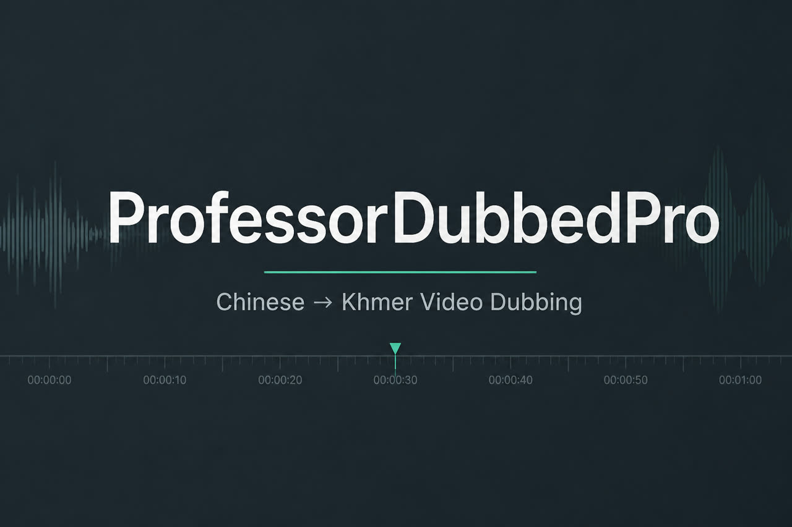

<p align="center">
  
</p>

<h1 align="center">ProfessorDubbedPro</h1>

<p align="center">
  <strong>Free &amp; open-source desktop studio for Chinese → Khmer video dubbing</strong>
</p>

<p align="center">
  <a href="LICENSE"></a>
  
  
  
</p>

<p align="center">
  <a href="#-quick-start"></a>
  <a href="#-features"></a>
  <a href="#-contributing"></a>
</p>

<p align="center">
  
</p>

---

Open a Chinese video, extract **spoken** dialogue, translate into natural Khmer, generate timed Edge-TTS voice, edit on a timeline, and export subtitles or subtitled video — **on your machine**.

> Built for creators, teachers, and small studios in Cambodia (and anyone who needs ZH→KM dubs) — without expensive cloud dubbing suites.  
> **Free for everyone.** Use it · share it · fork it · improve it.

---

## Why this project exists

Chinese short video, drama, and training content is everywhere — but **Khmer dubbing tools** are scarce, expensive, or locked into SaaS quotas.

ProfessorDubbedPro is a **Windows-first desktop app** that keeps the core loop local where it matters:

| # | Step | Focus |
|---|------|--------|
| 1 | **Listen** | Spoken audio (not burned-in AI captions) → Chinese script |
| 2 | **Translate** | Spoken Khmer — Fast MT or High Quality LLM + slang glossary |
| 3 | **Speak** | Microsoft Edge Khmer voices, gently fitted to cue timing |
| 4 | **Ship** | Edit · export SRT / soft subs / burn-in video |

A practical studio for real Khmer audiences — not a demo that dies behind a paywall.

---

## Features

<table>
<tr>
<td width="50%">

### Extract Subs
Local ASR from the **audio track**  
FunASR SenseVoice (Chinese default) · Whisper.cpp fallback

</td>
<td width="50%">

### Translate ZH → KM
**Fast** — Azure / Google  
**High Quality** — DeepSeek / Qwen / Gemini + slang glossary

</td>
</tr>
<tr>
<td width="50%">

### Generate TTS
Edge Read Aloud Khmer voices  
Mild lip-sync speed-up — **listenable**, not chipmunk

</td>
<td width="50%">

### Studio & Export
Timeline · preview · subtitle table  
Export `.srt` · soft-subs · burn-in video

</td>
</tr>
</table>

> **Status (v0.1):** Extract → Translate → TTS → edit → subtitle export works.  
> A full **mixed dubbed master** (replace original dialogue with Khmer audio) is still on the roadmap.

---

## Stack

```text
┌──────────────────────────────────────────────┐
│  SvelteKit + Svelte 5 + Tailwind v4 (UI)     │
├──────────────────────────────────────────────┤
│  Tauri 2 + Rust  (ASR · TTS · FFmpeg · IPC)  │
├──────────────────────────────────────────────┤
│  FunASR · whisper.cpp · Edge TTS · FFmpeg    │
└──────────────────────────────────────────────┘
```

| Layer | Tech |
|-------|------|
| Desktop shell | **Tauri 2** (Rust) |
| UI | **SvelteKit 2** · TypeScript · Tailwind v4 · shadcn-svelte |
| Package manager | **pnpm** |
| Chinese ASR | **FunASR / SenseVoice** *(recommended)* |
| Fallback ASR | **whisper.cpp** |
| Media | **FFmpeg** (auto-downloaded) |

---

## Requirements

| | Tool | Notes |
|---|------|--------|
| OS | Windows 10/11 (x64) | Primary target today |
| Runtime | Node.js **20+** | Tested with Node 22 |
| Packages | pnpm **10+** | `corepack enable` |
| Native | Rust (stable) | via [rustup](https://rustup.rs/) |
| UI host | WebView2 | Usually preinstalled on Windows |
| Optional | Python **3.10+** | For `pnpm funasr:setup` |
| Network | Internet | Edge TTS · first model download · optional LLM keys |

---

## Quick start

```bash
# 1. Clone
git clone https://github.com/uysuy/ProfessorDubbedPro.git
cd ProfessorDubbedPro

# 2. Install JS deps
pnpm install

# 3. Fetch FFmpeg + Whisper sidecars (first run may take a few minutes)
pnpm ffmpeg:download
pnpm whisper:download

# 4. Recommended — Chinese ASR via FunASR SenseVoice
pnpm funasr:setup

# 5. Launch the desktop studio
pnpm tauri:dev
```

<details>
<summary><strong>First FunASR run</strong></summary>

<br/>

The first **Extract Subs** may download SenseVoice / VAD weights from ModelScope (~hundreds of MB).  
They are cached under your user profile — later runs are much faster.

</details>

<details>
<summary><strong>Frontend only</strong> (UI without native ASR / TTS / export)</summary>

<br/>

```bash
pnpm install
pnpm dev
```

For full studio features, use `pnpm tauri:dev`.

</details>

---

## Typical workflow

```text
  Video ──► Extract Subs ──► Translate ──► Generate TTS ──► Edit ──► Export
   ZH         (audio ASR)      ZH → KM        Edge Khmer      timeline   SRT / video
```

1. **Open / drop** a Chinese video  
2. **Extract Subs** — spoken audio only  
3. **Translate** — Fast draft, or High Quality + LLM key for natural Khmer  
4. **Generate** Edge-TTS for selected cues (Lip sync on = mild speed, listenable)  
5. **Edit** timings / text on the table or timeline  
6. **Export** SRT or subtitled video  

Settings (voice, ASR engine, translate quality, API keys) live in **Project settings / Settings**.  
Keys stay in local preferences on your machine.

---

## Optional API keys

| Mode | What you need |
|------|----------------|
| Fast translate | Azure Translator key + region *(else unofficial Google gtx)* |
| High Quality | DeepSeek / Qwen / Gemini API key in Settings |

No key is required to open a video, extract with local ASR, or try Edge TTS (Edge needs network).

---

## Build a release installer

```bash
pnpm install
pnpm ffmpeg:download
pnpm whisper:download
pnpm tauri:build
```

Installers land under `src-tauri/target/release/bundle/` (NSIS / MSI on Windows).

---

## Scripts

| Command | Description |
|---------|-------------|
| `pnpm tauri:dev` | Desktop app (development) |
| `pnpm tauri:build` | Production desktop build |
| `pnpm dev` | Vite / SvelteKit UI only |
| `pnpm ffmpeg:download` | Ensure FFmpeg sidecar |
| `pnpm whisper:download` | Ensure whisper.cpp + models |
| `pnpm funasr:setup` | Create `.venv-funasr` + FunASR |
| `pnpm check` | Type / Svelte check |
| `pnpm lint` · `pnpm format` | ESLint / Prettier |

---

## Repository layout

```text
ProfessorDubbedPro/
├── docs/                     # README banner + icon
├── src/                      # SvelteKit UI
│   ├── lib/components/       # layout · studio · ui
│   ├── lib/stores/           # project · prefs · ASR · translate
│   ├── lib/tts/              # Edge-TTS helpers
│   └── routes/               # studio · projects · settings
├── src-tauri/                # Tauri 2 + Rust
│   ├── src/                  # transcribe · translate · tts · export
│   ├── binaries/             # FFmpeg (downloaded, gitignored)
│   └── models/               # Whisper models (downloaded, gitignored)
├── scripts/                  # ensure-* + FunASR Python sidecar
├── LICENSE                   # MIT
└── README.md
```

---

## Contributing

Issues, ideas, and PRs are welcome — especially:

- Better ZH→KM glossary / translation quality  
- macOS / Linux packaging  
- Dubbed-master audio mix export  
- ASR accuracy on noisy short-video audio  

Please keep changes focused and match existing TypeScript / Rust style.

<p align="center">
  <a href="https://github.com/uysuy/ProfessorDubbedPro/issues">Open an issue</a>
  ·
  <a href="https://github.com/uysuy/ProfessorDubbedPro/fork">Fork the repo</a>
  ·
  <a href="https://github.com/uysuy/ProfessorDubbedPro/pulls">Pull requests</a>
</p>

---

## License

Released under the **[MIT License](./LICENSE)** — free for personal and commercial use, modification, and redistribution, with attribution.

---

## Credits

[Tauri](https://tauri.app/) · [SvelteKit](https://kit.svelte.dev/) · [FunASR / SenseVoice](https://github.com/modelscope/FunASR) · [whisper.cpp](https://github.com/ggerganov/whisper.cpp) · [FFmpeg](https://ffmpeg.org/) · Microsoft Edge Read Aloud

<p align="center">
  
  <br/>
  <strong>Made for Khmer creators · Free for everyone</strong>
</p>
