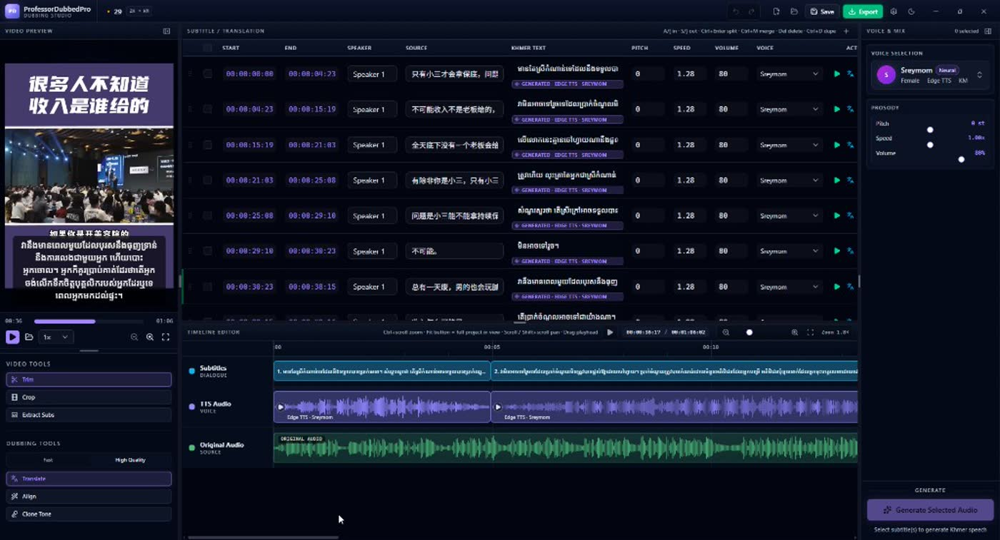
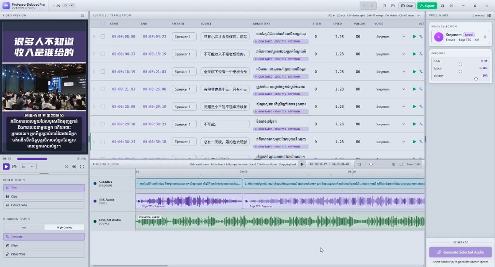
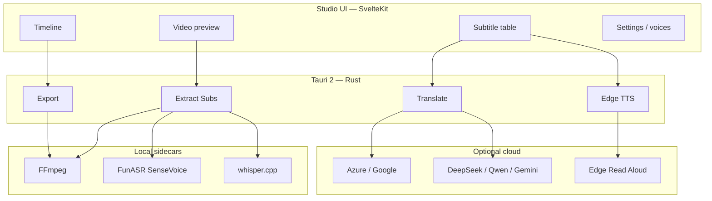

<p align="center">
  
</p>

<h1 align="center">ProfessorDubbedPro</h1>

<p align="center">
  <strong>Free &amp; open-source desktop studio for Chinese → Khmer video dubbing</strong><br/>
  Extract · Translate · Edge TTS · Timeline · Export — on your machine
</p>

<p align="center">
  <a href="LICENSE"></a>
  
  
  
</p>

<p align="center">
  <a href="#quick-start">Quick start</a> ·
  <a href="#studio-preview">Screenshots</a> ·
  <a href="#architecture">Architecture</a> ·
  <a href="#contributing">Contribute</a>
</p>


---

Open a Chinese video, extract **spoken** dialogue, translate into natural Khmer, generate timed Edge-TTS voice, edit on a timeline, and export subtitles or subtitled video.

> Built for creators, teachers, and small studios in Cambodia — and anyone who needs ZH→KM dubs — without expensive cloud suites.  
> **Free for everyone.** Use it · share it · fork it · improve it.

---

## Why this exists

Chinese short video and training content is everywhere, but **Khmer dubbing tools** are scarce or locked behind SaaS quotas.

ProfessorDubbedPro keeps the core loop local:

1. **Listen** — spoken audio (not burned-in AI captions) → Chinese script  
2. **Translate** — spoken Khmer (Fast MT or High Quality LLM + slang glossary)  
3. **Speak** — Edge Khmer voices, gently fitted to cue timing  
4. **Ship** — edit · export SRT / soft subs / burn-in video  

---

## Studio preview

Real app UI — works on GitHub.com and the GitHub mobile app (images scale to your screen).

### Overview — preview, tools & subtitle table



### Timeline — subtitles, TTS audio & original mix



---

## Features

- **Extract Subs** — local ASR from the audio track (FunASR SenseVoice for Chinese · Whisper.cpp fallback)
- **Translate ZH → KM** — Fast (Azure / Google) or High Quality (DeepSeek / Qwen / Gemini) with slang glossary
- **Generate TTS** — Edge Read Aloud Khmer voices; mild lip-sync speed (listenable, not chipmunk)
- **Studio** — timeline, preview, subtitle table, project save
- **Export** — `.srt`, soft-sub video, or burn-in subtitled video (FFmpeg)

> **v0.1 status:** Extract → Translate → TTS → edit → subtitle export works.  
> Full **mixed dubbed master** (replace original dialogue with Khmer audio) is on the roadmap.

---

## Architecture

How the studio fits together (renders on GitHub web & mobile):



### Pipeline

```text
Video  →  Extract Subs  →  Translate  →  Generate TTS  →  Edit  →  Export
 ZH        (audio ASR)      ZH → KM       Edge Khmer      timeline  SRT / video
```

| Layer | Role |
|-------|------|
| **SvelteKit UI** | Preview, cue table, timeline, generate / export controls |
| **Tauri / Rust** | Orchestrates ASR, translate, TTS, FFmpeg export |
| **FunASR / Whisper** | Local Chinese speech → timed source cues |
| **Edge TTS** | Khmer speech MP3 per cue |
| **FFmpeg** | Audio extract + subtitled video export |

---

## Stack

| | |
|--|--|
| Desktop | **Tauri 2** (Rust) |
| UI | **SvelteKit 2** · Svelte 5 · TypeScript · Tailwind v4 · shadcn-svelte |
| Packages | **pnpm** |
| Chinese ASR | **FunASR / SenseVoice** *(recommended)* |
| Fallback ASR | **whisper.cpp** |
| Media | **FFmpeg** (auto-downloaded) |

---

## Requirements

| Tool | Notes |
|------|--------|
| Windows 10/11 (x64) | Primary target |
| Node.js 20+ | Tested with 22 |
| pnpm 10+ | `corepack enable` |
| Rust (stable) | [rustup](https://rustup.rs/) |
| WebView2 | Usually preinstalled |
| Python 3.10+ | Optional — for FunASR |
| Internet | Edge TTS · first model download · optional LLM keys |

---

## Quick start

```bash
# 1. Clone
git clone https://github.com/uysuy/ProfessorDubbedPro.git
cd ProfessorDubbedPro

# 2. Install
pnpm install

# 3. Sidecars (first run may take a few minutes)
pnpm ffmpeg:download
pnpm whisper:download

# 4. Recommended — Chinese ASR
pnpm funasr:setup

# 5. Launch desktop studio
pnpm tauri:dev
```

<details>
<summary><strong>First FunASR run</strong></summary>

<br/>

First **Extract Subs** may download SenseVoice / VAD weights from ModelScope (~hundreds of MB, then cached).

</details>

<details>
<summary><strong>UI only</strong> (no native ASR / TTS / export)</summary>

<br/>

```bash
pnpm install
pnpm dev
```

Use `pnpm tauri:dev` for the full studio.

</details>

---

## Typical workflow

1. **Open / drop** a Chinese video  
2. **Extract Subs** — spoken audio only  
3. **Translate** — Fast draft, or High Quality + LLM key  
4. **Generate** Edge-TTS for selected cues  
5. **Edit** on the table / timeline  
6. **Export** SRT or subtitled video  

Settings and API keys live in **Project settings / Settings** (local on your machine).

### Optional API keys

| Mode | Need |
|------|------|
| Fast translate | Azure key + region *(else Google gtx)* |
| High Quality | DeepSeek / Qwen / Gemini key |

No key required to open a video, extract with local ASR, or try Edge TTS (Edge needs network).

---

## Build installer

```bash
pnpm install
pnpm ffmpeg:download
pnpm whisper:download
pnpm tauri:build
```

Output: `src-tauri/target/release/bundle/`

---

## Scripts

| Command | Description |
|---------|-------------|
| `pnpm tauri:dev` | Desktop app (dev) |
| `pnpm tauri:build` | Release build |
| `pnpm dev` | UI only |
| `pnpm ffmpeg:download` | FFmpeg sidecar |
| `pnpm whisper:download` | whisper.cpp + models |
| `pnpm funasr:setup` | FunASR venv |
| `pnpm check` | Type / Svelte check |
| `pnpm lint` · `pnpm format` | Lint / format |

---

## Repository layout

```text
ProfessorDubbedPro/
├── docs/                 # Banner, icon, screenshots
├── src/                  # SvelteKit UI
│   ├── lib/components/   # layout · studio · ui
│   ├── lib/stores/       # project · prefs · ASR · translate
│   └── routes/
├── src-tauri/            # Tauri + Rust
│   ├── src/              # transcribe · translate · tts · export
│   ├── binaries/         # FFmpeg (downloaded)
│   └── models/           # Whisper (downloaded)
├── scripts/              # ensure-* + FunASR Python
├── LICENSE
└── README.md
```

---

## Contributing

PRs and issues welcome — especially:

- ZH→KM glossary / translation quality  
- macOS / Linux packaging  
- Dubbed-master audio mix export  
- Noisy short-video ASR  

Keep changes focused; match existing TypeScript / Rust style.

[Issues](https://github.com/uysuy/ProfessorDubbedPro/issues) · [Fork](https://github.com/uysuy/ProfessorDubbedPro/fork) · [Pull requests](https://github.com/uysuy/ProfessorDubbedPro/pulls)

---

## License

**[MIT](./LICENSE)** — free for personal and commercial use, with attribution.

---

## Credits

[Tauri](https://tauri.app/) · [SvelteKit](https://kit.svelte.dev/) · [FunASR](https://github.com/modelscope/FunASR) · [whisper.cpp](https://github.com/ggerganov/whisper.cpp) · [FFmpeg](https://ffmpeg.org/) · Microsoft Edge Read Aloud

<p align="center">
  <br/>
  <strong>Made for Khmer creators · Free for everyone</strong>
</p>
